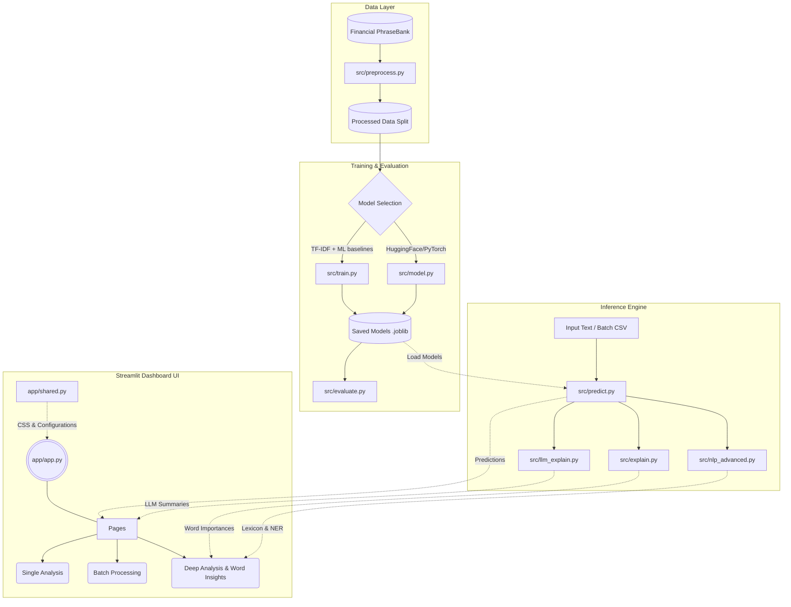

# Financial Sentiment Analyzer

A comprehensive machine learning project for analyzing sentiment in financial text data. Built with **TF-IDF baselines**, **Pre-trained FinBERT transformers**, and an interactive **Streamlit dashboard**.


---

## Table of Contents

- [Features](#features)
- [Model Performance](#model-performance)
- [Project Structure](#project-structure)
- [Installation](#installation)
- [Usage](#usage)
  - [Train Models](#train-models)
  - [Evaluate Models](#evaluate-models)
  - [Make Predictions](#make-predictions)
  - [Run Streamlit App](#run-streamlit-app)
- [Dashboard Features](#dashboard-features)
- [Dataset](#dataset)
- [API Usage](#api-usage)
- [Explainability](#explainability)
- [Deployment](#deployment)
- [Interview Preparation](#interview-preparation)
- [References](#references)
- [License](#license)

---

## Features

### Core Capabilities
- **8 Machine Learning Models**: From traditional ML to state-of-the-art transformers
- **Interactive Dashboard**: Beautiful Streamlit app with real-time analysis
- **Explainability**: Word importance visualization for model interpretability
- **Batch Processing**: Upload CSV/TXT files for bulk sentiment analysis
- **Model Comparison**: Comprehensive evaluation metrics and side-by-side comparison

### Advanced Features
- **AI-Powered Insights**: Natural language explanations of predictions
- **Word Insights**: Discover most influential positive/negative/neutral words
- **Sentiment Trend Analysis**: Bullish/Bearish/Mixed trend detection for batch data
- **Market Outlook Reports**: Automated summary generation for bulk analysis
- **Pre-trained FinBERT**: No training required - instant financial sentiment analysis

---

## Model Performance

| Model | Type | Accuracy | F1 (macro) | F1 (weighted) | Best For |
|-------|------|----------|------------|---------------|----------|
| **Gradient Boosting** | TF-IDF + Ensemble | **94.0%** | **0.92** | **0.94** | Highest accuracy |
| **SVM** | TF-IDF + Linear | 92.0% | 0.90 | 0.92 | Balanced performance |
| **FinBERT (Pre-trained)** | Transformer | ~90%* | ~0.88* | ~0.90* | Context understanding |
| Voting Ensemble | TF-IDF + Multi-model | 88.5% | 0.85 | 0.89 | Robust predictions |
| Logistic Regression | TF-IDF + Linear | 88.5% | 0.84 | 0.89 | Fast & interpretable |
| Random Forest | TF-IDF + Tree | 87.6% | 0.84 | 0.88 | Feature importance |
| MLP Neural Network | TF-IDF + Deep | 87.6% | 0.84 | 0.88 | Non-linear patterns |
| Naive Bayes | TF-IDF + Probabilistic | 86.3% | 0.81 | 0.86 | Baseline reference |

*\*FinBERT performance on Financial PhraseBank dataset (pre-trained, no fine-tuning)*

---

## Project Structure

```
mlProjectFinancialSent/
├── app/
│   └── app.py                  # Streamlit dashboard (main entry)
├── src/
│   ├── preprocess.py           # Data loading & text cleaning
│   ├── train.py                # Model training (all 7 baseline models)
│   ├── model.py                # Transformer models (FinBERT fine-tuning)
│   ├── evaluate.py             # Model evaluation & comparison
│   ├── predict.py              # Inference & prediction API
│   ├── explain.py              # Word importance & explainability
│   ├── finbert_pretrained.py   # Pre-trained FinBERT wrapper
│   └── llm_explain.py          # Natural language explanation generation
├── data/
│   ├── raw/                    # Financial PhraseBank dataset
│   └── processed/              # Train/val/test splits
├── models/                     # Saved trained models (.joblib)
├── notebooks/
│   └── eda.ipynb              # Exploratory data analysis
├── .streamlit/
│   └── config.toml            # Streamlit configuration
├── requirements.txt           # Full dependencies
├── requirements-deploy.txt    # Deployment dependencies (lighter)
└── README.md
```

### System Architecture Pipeline



---

## Important Files Breakdown

Here is a detailed explanation of the core files driving the Financial Sentiment Analyzer:

### Frontend (Streamlit Dashboard)
- `app/app.py`: The main entry point for the multipage dashboard. It renders the modern hero section, imports the global CSS, and acts as the project's visual wrapper.
- `app/shared.py`: The global UI/UX engine. It contains the centralized dark-mode CSS payload, sidebar configuration, and the `@st.cache_resource` model loader to prevent RAM bloat across pages.
- `app/pages/1_Single_Analysis.py`: Handles on-the-fly sentiment prediction and renders probability distribution charts.
- `app/pages/2_Batch_Processing.py`: Manages CSV/TXT file uploads, parallelizes batch sentiment scoring using `predict.py`, and visualizes aggregate KPIs.
- `app/pages/3_Explainability.py`: Connects to `explain.py` to highlight specific words (e.g., green chips for positive drivers) that influenced the model's decision.
- `app/pages/4_Word_Insights.py`: Connects to `nlp_advanced.py` to list out the highest-impact financial lexicon terms categorized by sentiment.
- `app/pages/5_Deep_Analysis.py`: Executes advanced linguistic decomposition, Chain-of-Thought reasoning, and entity-specific metrics (NER).
- `app/pages/6_Model_Info.py`: A comprehensive Model Registry that dynamically reads available trained algorithms and displays their metadata and validation metrics.

### Backend (Machine Learning & NLP)
- `src/preprocess.py`: Handles the raw `FinancialPhraseBank` loading, regex-based text cleaning, lowercasing, and train/test/val splitting.
- `src/train.py`: The primary machine learning pipeline. It handles feature extraction (TF-IDF) and trains the 7 highly-tuned baseline models (SVM, Random Forest, Gradient Boosting, etc.).
- `src/predict.py`: The unified inference API. It dynamically routes text requests to the correct model (whether it belongs to standard ML baselines or Transformers) and returns formatted probability dictionaries.
- `src/evaluate.py`: Calculates holistic performance metrics (Macro F1, Precision, Recall) and plots confusion matrices to validate model deployments.
- `src/explain.py`: Extracts model coefficients (for linear models) or utilizes lexicons to derive sub-word feature importance, essentially extracting the algorithm's "why".
- `src/nlp_advanced.py`: Uses `SpaCy` to perform Named Entity Recognition (NER), identifying organizations (Orgs), currency strings, and noun chunks for deep linguistic insights.
- `src/llm_explain.py`: Integrates with LLM APIs (like Google's Gemini) to generate human-readable, executive-level natural language explanations of a localized market dynamic.
- `src/finbert_pretrained.py`: A specialized HuggingFace wrapper exclusively for the `ProsusAI/finbert` model, handling its unique label mapping without requiring local fine-tuning.
- `src/model.py`: A PyTorch neural network module responsible for handling fine-tuning operations on raw Transformer/BERT sequence classification models.

### Infrastructure & Engineering
- `tests/`: Contains isolated `pytest` modules (`test_predict.py`, `test_preprocess.py`, etc.) ensuring safe CI/CD operations and safeguarding against regressions.
- `Makefile`: Enterprise standard task automation for environment setup, testing, formatting (`ruff`), and running the app.
- `.github/workflows/`: Contains the CI/CD pipeline configuration, ensuring tests and linting check out autonomously upon every pull request.
- `Dockerfile`: Orchestrates the containerized build sequence for scalable cloud deployments (AWS/GCP) using lightweight Python images.

---

## Installation

### 1. Clone the repository

```bash
git clone https://github.com/hemangbhat/FinSentAnalyzer.git
cd FinSentAnalyzer
```

### 2. Create virtual environment

```bash
python -m venv venvMlProject

# Windows
venvMlProject\Scripts\activate

# Linux/Mac
source venvMlProject/bin/activate
```

### 3. Install dependencies

```bash
# Full installation (includes PyTorch for FinBERT)
pip install -r requirements.txt

# Lightweight installation (for deployment without transformers)
pip install -r requirements-deploy.txt
```

### 4. Download dataset

The Financial PhraseBank dataset should be in `data/raw/FinancialPhraseBank-v1.0/`.

Alternatively, it will be automatically downloaded from HuggingFace datasets.

---

## Usage

### Train Models

```bash
# Train ALL baseline models (recommended)
python src/train.py --model baselines

# Train specific baseline model
python src/train.py --model svm
python src/train.py --model logreg
python src/train.py --model naive_bayes
python src/train.py --model random_forest
python src/train.py --model gradient_boosting
python src/train.py --model mlp

# Train voting ensemble
python src/train.py --model ensemble

# Fine-tune FinBERT (requires GPU for reasonable speed)
python src/train.py --model finbert --epochs 3
```

### Evaluate Models

```bash
# Compare all trained models
python src/evaluate.py

# Evaluate specific model on test set
python src/evaluate.py --model baseline_svm --split test

# Save results and plot confusion matrices
python src/evaluate.py --save --plot
```

### Make Predictions

```bash
# Single prediction
python src/predict.py --text "Company reports strong quarterly earnings"

# Batch prediction from file
python src/predict.py --file input.csv --output results.csv

# Interactive mode
python src/predict.py

# List all available models
python src/predict.py --list-models
```

### Run Streamlit App

```bash
streamlit run app/app.py
```

The app will open at `http://localhost:8501`

---

## Dashboard Features

### 1. Single Analysis
- Enter any financial text
- Get instant sentiment prediction
- View confidence scores and probability distribution
- AI-generated natural language explanation

### 2. Batch Processing
- Upload CSV or TXT files
- Analyze hundreds of texts at once
- Download results with predictions
- Sentiment distribution visualization
- **Market Outlook Report**: Bullish/Bearish/Mixed trend analysis

### 3. Explainability
- Interactive word importance visualization
- See which words drive predictions
- Understand model decision-making

### 4. Word Insights
- Discover top positive/negative/neutral words
- Learn the vocabulary that influences predictions
- Feature importance summary

### 5. Model Info
- View current model details
- Compare all 8 models
- See accuracy, F1 scores, and features
- Model selection guidance

---

## Dataset

**Financial PhraseBank** by Malo et al. (2014)

- **4,840 sentences** from financial news articles
- Annotated by **16 financial experts**
- **3 sentiment classes**: Positive, Neutral, Negative
- Using **100% annotator agreement subset** (2,264 high-quality sentences)

### Class Distribution
| Sentiment | Count | Percentage |
|-----------|-------|------------|
| Neutral | ~1,570 | 59% |
| Positive | ~620 | 23% |
| Negative | ~470 | 18% |

---

## API Usage

```python
from src.predict import SentimentPredictor

# Initialize predictor with any model
predictor = SentimentPredictor("baseline_svm")  # or "finbert_pretrained"

# Single prediction
result = predictor.predict("Company beats earnings expectations")
print(result)
# {
#     'text': 'Company beats earnings expectations',
#     'prediction': 2,
#     'label': 'positive',
#     'confidence': 0.87,
#     'probabilities': {'negative': 0.05, 'neutral': 0.08, 'positive': 0.87}
# }

# Batch prediction
results = predictor.predict([
    "Revenue increased by 25%",
    "Stock prices fell sharply",
    "Dividend policy unchanged"
])
for r in results:
    print(f"{r['label']}: {r['text']}")
```

### Using Pre-trained FinBERT

```python
from src.finbert_pretrained import predict_with_finbert

# No training needed - instant predictions
result = predict_with_finbert("Markets rally on positive economic data")
print(f"Sentiment: {result['label']} ({result['confidence']:.1%})")
# Sentiment: positive (89.2%)
```

---

## Explainability

### Word Importance Visualization

```python
from src.explain import explain_prediction_baseline

explanation = explain_prediction_baseline(
    "Company reports strong earnings growth",
    model_name="baseline_svm"
)

# Top positive indicators
print(explanation["positive_words"])
# [('growth', 0.15), ('strong', 0.12), ('earnings', 0.08)]

# Top negative indicators
print(explanation["negative_words"])
# [('loss', -0.02), ('decline', -0.01)]
```

### Natural Language Explanations

```python
from src.llm_explain import generate_explanation_template

text = "The company reported record profits this quarter"
explanation = generate_explanation_template(text, "positive", 0.92)
print(explanation)
# "This text expresses POSITIVE sentiment (92% confidence).
#  Key indicators: 'record profits' suggests strong performance..."
```

---

## Deployment

### Streamlit Cloud (Recommended)

1. Push your code to GitHub
2. Go to [share.streamlit.io](https://share.streamlit.io)
3. Connect your GitHub repository
4. Set main file path: `app/app.py`
5. Deploy!

### HuggingFace Spaces

1. Create a new Space on [huggingface.co/spaces](https://huggingface.co/spaces)
2. Select "Streamlit" as the SDK
3. Upload your files or connect to GitHub
4. The app will auto-deploy

### Local Docker

```bash
docker build -t financial-sentiment .
docker run -p 8501:8501 financial-sentiment
```

---

## Interview Preparation

Before adding this project to your resume, ensure you can confidently answer:

### Technical Questions

**Q1: Why does FinBERT perform better than TF-IDF baselines?**
> FinBERT is pre-trained on financial text, understanding domain-specific context and nuances. TF-IDF treats words independently, while transformers capture semantic relationships and context. FinBERT understands that "beat expectations" is positive even without the word "good".

**Q2: Explain precision vs recall vs F1 score.**
> - **Precision**: Of all predictions marked positive, how many were actually positive? (Minimizes false positives)
> - **Recall**: Of all actual positives, how many did we correctly identify? (Minimizes false negatives)
> - **F1 Score**: Harmonic mean of precision and recall. Balances both metrics when you can't afford to ignore either.

**Q3: Why might the model misclassify neutral vs positive?**
> Neutral financial statements often contain factual numbers without explicit sentiment words. A statement like "Revenue was $5M" could be positive (if expectations were $4M) or negative (if expectations were $6M) depending on context the model doesn't have.

**Q4: What's a real-world use case for this project?**
> - **Trading firms**: Analyze news headlines before market open to gauge sentiment
> - **Risk management**: Monitor press releases for negative sentiment signals
> - **PR teams**: Track media coverage sentiment about their company
> - **Analysts**: Quickly process earnings call transcripts

### Architecture Questions

**Q5: How does TF-IDF work?**
> TF-IDF (Term Frequency - Inverse Document Frequency) weights words by how often they appear in a document (TF) penalized by how common they are across all documents (IDF). Rare but frequent terms within a document get higher scores.

**Q6: Why use SVM over Logistic Regression?**
> SVM with linear kernel works well for high-dimensional sparse data like TF-IDF vectors. It finds the optimal hyperplane separating classes with maximum margin. For this dataset, SVM achieved 92% vs LogReg's 88.5% accuracy.

**Q7: What is the Voting Ensemble?**
> Combines predictions from multiple models (Logistic Regression, SVM, Random Forest) using soft voting (averaging probabilities). This often produces more robust predictions than any single model.

**Q8: Why did you choose Gradient Boosting?**
> Gradient Boosting builds trees sequentially, each correcting errors of the previous. It achieved 94% accuracy - the highest among baselines - by learning complex patterns in the TF-IDF features.

### MLOps Questions

**Q9: How would you deploy this at scale?**
> - Containerize with Docker
> - Use FastAPI for REST API endpoints
> - Deploy on AWS/GCP with auto-scaling
> - Add model versioning with MLflow
> - Implement A/B testing for new models

**Q10: How would you monitor model performance in production?**
> - Track prediction latency and throughput
> - Monitor confidence score distributions
> - Set up alerts for prediction drift
> - Collect human feedback for ground truth
> - Regular evaluation on labeled samples

---

## Technologies Used

| Category | Technologies |
|----------|-------------|
| **ML Frameworks** | scikit-learn, PyTorch, Transformers |
| **NLP** | TF-IDF, FinBERT, HuggingFace |
| **Web App** | Streamlit, Plotly |
| **Data Processing** | Pandas, NumPy |
| **Model Persistence** | Joblib |
| **Version Control** | Git, GitHub |

---

## References

- Malo, P., et al. (2014). "Good debt or bad debt: Detecting semantic orientations in economic texts"
- [ProsusAI/finbert](https://huggingface.co/ProsusAI/finbert) - Pre-trained FinBERT model
- [Financial PhraseBank](https://huggingface.co/datasets/financial_phrasebank)

---

## Contributing

Contributions are welcome! Please feel free to submit a Pull Request.

1. Fork the repository
2. Create your feature branch (`git checkout -b feature/AmazingFeature`)
3. Commit your changes (`git commit -m 'Add some AmazingFeature'`)
4. Push to the branch (`git push origin feature/AmazingFeature`)
5. Open a Pull Request

---

## License

MIT License - see [LICENSE](LICENSE) file for details.

---

## Author

Built with passion for ML and Finance.

**Repository**: [https://github.com/hemangbhat/FinSentAnalyzer](https://github.com/hemangbhat/FinSentAnalyzer)
