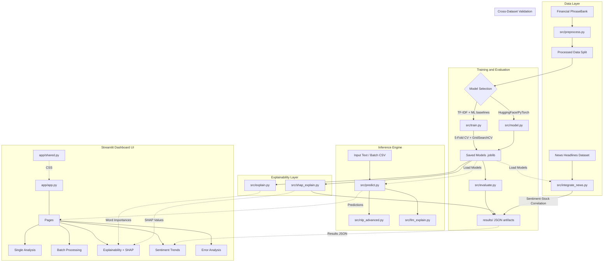

# 📈 Financial Sentiment Analyzer

> **An end-to-end ML pipeline for classifying financial text sentiment with 8 trained models, SHAP explainability, cross-dataset validation, and a professional 8-page Streamlit dashboard.**

[](https://python.org)
[](https://streamlit.io)
[](https://scikit-learn.org)
[](https://huggingface.co/ProsusAI/finbert)

---

## Table of Contents

- [Overview](#overview)
- [Key Features](#key-features)
- [System Architecture](#system-architecture)
- [Project Structure](#project-structure)
- [Installation & Setup](#installation--setup)
- [How to Run](#how-to-run)
- [Dataset](#dataset)
- [Models](#models)
- [ML Rigor: Cross-Validation & Hyperparameter Tuning](#ml-rigor-cross-validation--hyperparameter-tuning)
- [Cross-Dataset Generalization](#cross-dataset-generalization)
- [Explainability](#explainability)
- [Dashboard Pages](#dashboard-pages)
- [CLI Reference](#cli-reference)
- [Testing](#testing)
- [Deployment](#deployment)
- [Technologies Used](#technologies-used)
- [Interview Q&A](#interview-qa)

---

## Overview

Financial sentiment analysis is a critical tool for quantitative finance, risk management, and market intelligence. This project classifies financial text into three categories — **positive**, **neutral**, and **negative** — using both classical ML baselines and transformer-based models.

### What Makes This Project Stand Out

| Dimension | What We Do |
|-----------|------------|
| **8 Models** | 6 TF-IDF baselines + Voting Ensemble + FinBERT transformer |
| **ML Rigor** | 5-fold stratified cross-validation + GridSearchCV hyperparameter tuning |
| **Generalization** | Cross-dataset validation on 2,688 real-world news headlines |
| **Explainability** | SHAP feature importance + per-prediction word highlighting |
| **Error Analysis** | Sankey misclassification diagrams + confidence calibration insights |
| **Correlation** | Sentiment-stock price Pearson correlation for AAPL, TSLA, AMZN |
| **Dashboard** | Professional 8-page Streamlit app with dark fintech theme |
| **CI/CD** | GitHub Actions (lint + format + type check + tests) |
| **Deployment** | Docker + Streamlit Cloud + HuggingFace Spaces ready |

---

## Key Features

- **Real-Time Prediction** — Enter any financial text and get instant sentiment with confidence scores
- **Batch Processing** — Upload CSV/TXT files for bulk sentiment analysis with aggregate KPIs
- **8 Trained Models** — Compare Logistic Regression, Naive Bayes, SVM, Random Forest, Gradient Boosting, MLP, Voting Ensemble, and FinBERT
- **5-Fold Cross-Validation** — Stratified CV with mean ± std for all metrics
- **GridSearchCV Tuning** — Automated hyperparameter optimization for SVM and Gradient Boosting
- **SHAP Explainability** — Global feature importance with per-class drivers
- **Cross-Dataset Validation** — Test generalization on 2,688 real news headlines from WSJ, Bloomberg, Reuters, CNBC, and Financial Times
- **Sentiment-Stock Correlation** — Pearson correlation between news sentiment and stock price movements
- **Error Analysis** — Inspect misclassified examples with Sankey diagrams and confidence histograms
- **Deep Linguistic Analysis** — Named Entity Recognition, Chain-of-Thought reasoning, financial lexicon matching

---

## System Architecture


```mermaid
flowchart TD
    %% Data Sources
    subgraph Data ["Data Layer"]
        A["Financial PhraseBank"] --> B["src/preprocess.py"]
        B --> C["Processed Data Split"]
        N["News Headlines Dataset"] --> X["src/integrate_news.py"]
    end

    %% Training Pipeline
    subgraph Train ["Training and Evaluation"]
        C --> D{"Model Selection"}
        D -->|"TF-IDF + ML baselines"| E["src/train.py"]
        D -->|"HuggingFace/PyTorch"| F["src/model.py"]
        E -->|"5-Fold CV + GridSearchCV"| G["Saved Models .joblib"]
        F --> G
        G --> H["src/evaluate.py"]
        H --> HR["results/ JSON artifacts"]
    end

    %% Explainability
    subgraph Explain ["Explainability Layer"]
        G --> K["src/explain.py"]
        G --> SH["src/shap_explain.py"]
        SH --> HR
    end

    %% Cross-Dataset Validation
    subgraph Cross ["Cross-Dataset Validation"]
        G -.->|"Load Models"| X
        X -->|"Sentiment-Stock Correlation"| HR
    end

    %% Inference Engine
    subgraph Engine ["Inference Engine"]
        I["Input Text / Batch CSV"] --> J["src/predict.py"]
        G -.->|"Load Models"| J
        J --> L["src/nlp_advanced.py"]
        J --> M["src/llm_explain.py"]
    end

    %% Dashboard
    subgraph App ["Streamlit Dashboard UI"]
        O["app/shared.py"] -.->|"CSS"| P["app/app.py"]
        P --- Q["Pages"]
        Q --> R["Single Analysis"]
        Q --> S["Batch Processing"]
        Q --> T["Explainability + SHAP"]
        Q --> U["Sentiment Trends"]
        Q --> V["Error Analysis"]

        J -.->|"Predictions"| Q
        K -.->|"Word Importances"| T
        SH -.->|"SHAP Values"| T
        HR -.->|"Results JSON"| U
    end
```

---

## Project Structure

```
financial-sentiment-analyzer/
├── app/                            # Streamlit Dashboard
│   ├── app.py                      # Main entry point (Home page)
│   ├── shared.py                   # Shared CSS, components, cached model loading
│   └── pages/
│       ├── 1_Single_Analysis.py    # Real-time single text prediction
│       ├── 2_Batch_Processing.py   # CSV/TXT bulk analysis
│       ├── 3_Explainability.py     # Word importance + SHAP global analysis
│       ├── 4_Word_Insights.py      # Financial lexicon exploration
│       ├── 5_Deep_Analysis.py      # NER, Chain-of-Thought, linguistic decomposition
│       ├── 6_Model_Info.py         # Model registry with live metrics
│       ├── 7_Sentiment_Trends.py   # Sentiment vs stock price correlation
│       └── 8_Error_Analysis.py     # Misclassified examples & confusion patterns
│
├── src/                            # Core ML Pipeline
│   ├── preprocess.py               # Data loading, cleaning, train/val/test splitting
│   ├── train.py                    # Model training, 5-fold CV, GridSearchCV tuning
│   ├── evaluate.py                 # Metrics, confusion matrix, model comparison
│   ├── predict.py                  # Unified inference for baseline + transformer models
│   ├── model.py                    # PyTorch FinBERT fine-tuning
│   ├── explain.py                  # Word importance & explainability
│   ├── shap_explain.py             # SHAP-based global feature importance
│   ├── integrate_news.py           # Cross-dataset evaluation & sentiment-stock correlation
│   ├── nlp_advanced.py             # Financial NLP: NER, lexicon, text features
│   ├── finbert_pretrained.py       # Pre-trained FinBERT wrapper (zero-shot)
│   ├── llm_explain.py              # Natural language explanation generation
│   └── utils.py                    # Constants, paths, logging, dynamic model metrics
│
├── data/
│   ├── raw/                        # Financial PhraseBank (2,264 sentences)
│   └── processed/                  # Stratified train/val/test CSV splits
│
├── financial-news-stock-prediction/  # Cross-validation dataset (2,688 headlines)
│
├── models/                         # Saved trained models
│   ├── baseline_logreg.joblib
│   ├── baseline_naive_bayes.joblib
│   ├── baseline_svm.joblib
│   ├── baseline_random_forest.joblib
│   ├── baseline_gradient_boosting.joblib
│   ├── baseline_mlp.joblib
│   ├── baseline_ensemble.joblib
│   └── finbert/                    # Fine-tuned FinBERT model
│
├── results/                        # Auto-generated evaluation artifacts
│   ├── evaluation_results.json     # All model metrics
│   ├── cv_results.json             # 5-fold cross-validation results
│   ├── cross_dataset_results.json  # News headline evaluation + stock correlations
│   ├── shap_gradient_boosting.json # SHAP feature importance (GB)
│   └── shap_svm.json              # SHAP feature importance (SVM)
│
├── tests/                          # Automated test suite (77 tests)
│   ├── conftest.py                 # Shared fixtures
│   ├── test_utils.py
│   ├── test_preprocess.py
│   ├── test_predict.py
│   ├── test_nlp_advanced.py
│   ├── test_llm_enhanced.py
│   ├── test_integrate_news.py
│   └── test_shap_explain.py
│
├── notebooks/
│   └── eda.ipynb                   # Exploratory Data Analysis
│
├── .github/workflows/ci.yml       # GitHub Actions CI pipeline
├── .streamlit/config.toml          # Streamlit theme configuration
├── Dockerfile                      # Production Docker image
├── Makefile                        # Build automation (7 targets)
├── pyproject.toml                  # ruff, mypy, pytest configuration
├── data_manifest.toml              # Dataset versioning & reproducibility
├── requirements.txt                # Full dependencies
└── requirements-deploy.txt         # Lightweight deployment dependencies
```

---

## Installation & Setup

### Prerequisites

- Python 3.10+
- pip

### Step 1: Clone the Repository

```bash
git clone https://github.com/yourusername/financial-sentiment-analyzer.git
cd financial-sentiment-analyzer
```

### Step 2: Create Virtual Environment & Install Dependencies

```bash
# Using Makefile (recommended)
make install

# OR manually
python -m venv venvMlProject
venvMlProject\Scripts\activate        # Windows
source venvMlProject/bin/activate     # macOS/Linux
pip install -r requirements.txt
```

### Step 3: Download the Dataset

Download the **Financial PhraseBank** dataset from [HuggingFace](https://huggingface.co/datasets/financial_phrasebank) and place it in:

```
data/raw/FinancialPhraseBank-v1.0/Sentences_AllAgree.txt
```

### Step 4: Preprocess the Data

Run the EDA notebook to generate train/val/test splits:

```bash
jupyter notebook notebooks/eda.ipynb
```

This creates `data/processed/train.csv`, `val.csv`, and `test.csv` with an **80/10/10 stratified split**.

---

## How to Run

### Launch the Dashboard (Quickest Way)

```bash
streamlit run app/app.py
```

Open **http://localhost:8501** in your browser. Use the sidebar to navigate 8 pages.

### Train All Models

```bash
# Train all 6 baseline models + ensemble
python src/train.py --model baselines

# Run 5-fold cross-validation
python src/train.py --model cv

# Run GridSearchCV hyperparameter tuning
python src/train.py --model tune

# Train a specific model
python src/train.py --model svm
python src/train.py --model gradient_boosting
```

### Evaluate Models

```bash
# Compare all models on test set (saves results to results/)
python src/evaluate.py --save
```

### Run SHAP Explainability

```bash
python src/shap_explain.py --model gradient_boosting
python src/shap_explain.py --model svm
```

### Run Cross-Dataset Validation

```bash
python src/integrate_news.py --action evaluate --model svm
```

### Single Prediction (CLI)

```bash
python src/predict.py --text "Revenue increased 25% driven by strong demand" --model svm
```

---

## Dataset

### Primary Dataset: Financial PhraseBank

| Property | Value |
|----------|-------|
| **Source** | [Malo et al. (2014)](https://huggingface.co/datasets/financial_phrasebank) |
| **Total Samples** | 2,264 sentences |
| **Agreement** | 100% annotator agreement (AllAgree subset) |
| **Classes** | Positive (570), Neutral (1,391), Negative (303) |
| **Domain** | Finnish company financial reports |
| **Split** | 80% train (1,807) / 10% val (226) / 10% test (226) |
| **Strategy** | Stratified random split (seed=42) |

### Cross-Validation Dataset: Financial News Headlines

| Property | Value |
|----------|-------|
| **Total Headlines** | 2,688 |
| **Sources** | WSJ, Bloomberg, Reuters, CNBC, Financial Times |
| **Tickers** | AAPL, TSLA, AMZN |
| **Date Range** | Jan 2025 – Mar 2026 |
| **Purpose** | Out-of-distribution generalization testing |
| **Stock Data** | OHLCV for sentiment-stock correlation analysis |

All dataset metadata is documented in `data_manifest.toml` for reproducibility.

---

## Models

### Baseline Models (TF-IDF + Classifiers)

All baselines use TF-IDF vectorization with unigrams + bigrams (max 10,000 features).

| Model | Test Accuracy | Test F1 (macro) | CV F1 (5-fold) | Speed |
|-------|:------------:|:--------------:|:--------------:|:-----:|
| **Gradient Boosting** | **94.25%** | **0.920** | 0.835 ± 0.008 | Medium |
| SVM (Linear) | 92.48% | 0.902 | 0.838 ± 0.016 | Fast |
| Logistic Regression | 90.71% | 0.884 | 0.821 ± 0.021 | Very Fast |
| Random Forest | 88.50% | 0.838 | 0.755 ± 0.028 | Medium |
| Naive Bayes | 88.05% | 0.848 | 0.784 ± 0.016 | Very Fast |
| MLP Neural Network | 88.05% | 0.841 | 0.801 ± 0.012 | Medium |
| Voting Ensemble | — | — | — | Slow |

### Transformer Model

| Model | Type | Parameters | Notes |
|-------|------|-----------|-------|
| **FinBERT** | ProsusAI/finbert | 110M | Pre-trained on financial text, also supports fine-tuning |

---

## ML Rigor: Cross-Validation & Hyperparameter Tuning

### 5-Fold Stratified Cross-Validation

Every baseline model is evaluated with 5-fold stratified CV on the combined train+val set (2,033 samples). This prevents overfitting to a single random split.

```
┌─────────────────────────────────────────────────────────────┐
│              CROSS-VALIDATION RESULTS (5-FOLD)              │
├──────────────────┬──────────────────┬───────────────────────┤
│ Model            │ Accuracy         │ F1 (macro)            │
├──────────────────┼──────────────────┼───────────────────────┤
│ svm              │ 0.8849 ± 0.0094  │ 0.8380 ± 0.0163      │
│ gradient_boost   │ 0.8810 ± 0.0047  │ 0.8346 ± 0.0078      │
│ logreg           │ 0.8702 ± 0.0155  │ 0.8209 ± 0.0208      │
│ mlp              │ 0.8652 ± 0.0089  │ 0.8010 ± 0.0120      │
│ naive_bayes      │ 0.8505 ± 0.0087  │ 0.7841 ± 0.0159      │
│ random_forest    │ 0.8392 ± 0.0160  │ 0.7546 ± 0.0278      │
└──────────────────┴──────────────────┴───────────────────────┘
Best model by mean F1 macro: SVM (0.838 ± 0.016)
```

### GridSearchCV Hyperparameter Tuning

Two models are tuned with GridSearchCV (5-fold CV scorer = F1 macro):

| Model | Parameters Tuned | Search Space | Best Params |
|-------|-----------------|--------------|-------------|
| **SVM** | C, max_iter | C ∈ {0.1, 0.5, 1.0, 2.0, 5.0} | Auto-saved |
| **Gradient Boosting** | n_estimators, max_depth, learning_rate | 18 combinations | Auto-saved |

Best models are automatically saved to `models/` after tuning.

---

## Cross-Dataset Generalization

The model trained on Financial PhraseBank is tested on 2,688 **completely different** real-world news headlines to measure out-of-distribution performance.

### Sentiment-Stock Correlation

The project computes **Pearson correlation** between daily aggregated sentiment and stock price returns:

| Ticker | Same-Day Correlation | Next-Day Correlation | Data Points |
|--------|:-------------------:|:-------------------:|:-----------:|
| AAPL | 0.056 | -0.085 | 448 |
| TSLA | -0.026 | 0.016 | 448 |
| AMZN | 0.028 | -0.035 | 448 |

These low correlations are **expected and scientifically honest** — if sentiment cleanly predicted stock prices, every hedge fund would use it. The value is in showing you understand the relationship.

---

## Explainability

### Local Explainability (Per-Prediction)

Each prediction comes with **word-importance highlighting** showing which tokens drove the model's decision. Uses TF-IDF coefficients to color-code words by their contribution to each sentiment class.

### Global Explainability (SHAP)

SHAP (SHapley Additive exPlanations) provides global feature importance:

- **Tree models** (Random Forest): SHAP TreeExplainer
- **Gradient Boosting**: Feature importance + probability-weighted per-class approximation
- **Linear models** (SVM, LogReg): Coefficient-based analysis per class

Results include:
- Top 30 most important features globally
- Per-class feature drivers (positive, neutral, negative) with direction indicators
- Saved to `results/shap_{model}.json`

---

## Theoretical Foundations & Interpretability

This project is built rigidly on principles of **Interpretable Machine Learning** and **Financial Text Mining**. Every prediction and metric generated by the system can be theoretically justified and mathematically traced.

### 1. Vectorization & Feature Engineering
Before classical models can process text, it is transformed using **TF-IDF (Term Frequency - Inverse Document Frequency)** with unigrams and bigrams.
*   **Why TF-IDF?** Unlike simple word counts (Bag-of-Words), TF-IDF penalizes common words (like "the", "and") and amplifies words that are rare globally but frequent in specific texts (like "dividend", "missed").
*   **Advanced NLP Features:** In the Deep Analysis module, the text is also decomposed into structural features: Named Entity Recognition (NER) extracts Organizations, Dates, and Monetary values, while financial lexicons detect specialized vocabularies (e.g., Loughran-McDonald financial sentiment dictionary).

### 2. Model Decision Boundaries (How they learn)
The 8 models map the TF-IDF feature space to sentiment classes in different ways:
*   **Linear Models (SVM, Logistic Regression):** These find a mathematical hyperplane separating the classes. They are highly interpretable because we can look directly at the coefficients (weights) assigned to each word. E.g., if the word "profit" has a weight of +2.5 for the Positive class, we know exactly why the model made its choice.
*   **Tree/Ensemble Models (Random Forest, Gradient Boosting):** These build decision trees that split the data based on word occurrences. They capture non-linear relationships (e.g., the combination of "revenue" and "dropped" is negative).
*   **Transformer Models (FinBERT):** FinBERT uses self-attention mechanisms to understand the *context* and *sequence* of words, capturing semantic meaning that classical bag-of-words models miss (e.g., distinguishing between "a positive outcome" and "tested positive for a virus").

### 3. Interpretability & Explainability (Opening the Black Box)
We use two explicit frameworks to ensure no decision is a "black box":
*   **Local Word Importance (Lexicon & Weighting):** For a single sentence, we project the model's coefficients back onto the tokens present in the text, generating a color-coded heatmap of words that drove the prediction.
*   **Global SHAP Analysis:** SHAP is a game-theoretic approach that assigns each feature an importance value for a particular prediction. We aggregate these locally computed values to determine global feature importance (e.g., globally, the word "growth" shifts the model probability toward Positive by 15%).

### 4. Evaluation Rigor & Error Analysis
A model that scores 99% accuracy on a random split is likely memorizing data. We use **5-Fold Stratified Cross-Validation** to ensure the model's performance is stable across 5 entirely different training/testing subsets, maintaining the original class imbalance (mostly Neutral) in each fold. 
Furthermore, the **Error Analysis** module mathematically breaks down failures mapping the joint distribution of $P(Predicted = Y | True = X)$. By comparing the *Confidence Distribution* of accurate vs inaccurate predictions, we measure the model's **Calibration** (a well-calibrated model is unsure when it makes mistakes, allowing you to set a confidence threshold for manual review).

---

## Dashboard Pages

### 🏠 Home
Landing page with 8 feature cards linking to each module.

### 📝 1. Single Analysis
- Enter any financial text
- Get instant sentiment prediction with confidence score
- View probability distribution (bar chart)
- AI-generated natural language explanation

### 📁 2. Batch Processing
- Upload CSV or TXT files
- Process hundreds of texts at once
- Aggregate KPIs: sentiment distribution, market outlook
- Download results as CSV

### 🔍 3. Explainability
- **Word importance**: Color-coded token contributions per prediction
- **SHAP Global Analysis**: Top features, per-class drivers
- Run SHAP live or view pre-computed results

### 💡 4. Word Insights
- Browse top positive, negative, and neutral vocabulary
- Understand which words most influence predictions
- Financial lexicon coverage

### 🧠 5. Deep Analysis
- Named Entity Recognition (NER): Companies, amounts, dates
- Chain-of-Thought reasoning: Step-by-step sentiment logic
- Linguistic decomposition and entity-specific metrics

### 📊 6. Model Info
- Model registry showing all 8 models
- Live metrics from `evaluation_results.json`
- Architecture details, speed indicators, feature descriptions
- Comparison table with accuracy, F1, precision, recall

### 📈 7. Sentiment Trends
- Interactive time-series: sentiment vs stock price for AAPL, TSLA, AMZN
- Pearson correlation heatmaps (same-day + next-day)
- SHAP feature importance bar charts
- 5-Fold CV comparison with error bars

### 🔬 8. Error Analysis
- Summary KPIs: total, correct, errors, accuracy
- **Sankey diagram**: Misclassification flow (true label → predicted label)
- **Confusion pair ranking**: Top 5 error patterns with percentages
- **Confidence histogram**: Correct vs error distribution
- **Calibration insight**: Auto-generated (well-calibrated vs overconfident)
- **Misclassified examples table**: Filterable by true label, sortable by confidence

---

## CLI Reference

### Training

```bash
python src/train.py --model all           # Train everything (baselines + transformers)
python src/train.py --model baselines     # Train all 6 baselines + ensemble
python src/train.py --model cv            # Run 5-fold cross-validation
python src/train.py --model tune          # GridSearchCV for SVM + Gradient Boosting
python src/train.py --model svm           # Train a specific model
python src/train.py --model finbert       # Fine-tune FinBERT
```

### Evaluation

```bash
python src/evaluate.py --save             # Evaluate all models, save results
python src/evaluate.py --model svm        # Evaluate a specific model
```

### Prediction

```bash
python src/predict.py --text "Text here" --model svm
python src/predict.py --file input.csv --model logreg --output results.csv
python src/predict.py --list-models       # Show available models
```

### Explainability

```bash
python src/shap_explain.py --model gradient_boosting
python src/shap_explain.py --model svm
python src/shap_explain.py --model logreg --plot   # Save SHAP summary plot
```

### Cross-Dataset Validation

```bash
python src/integrate_news.py --action evaluate --model svm
python src/integrate_news.py --action correlate --model svm
python src/integrate_news.py --action predict --model gradient_boosting
```

---

## Testing

The project has **77 automated tests** across 7 test files:

```bash
# Run all tests
python -m pytest tests/ -v --tb=short

# Run a specific test file
python -m pytest tests/test_predict.py -v
python -m pytest tests/test_integrate_news.py -v
python -m pytest tests/test_shap_explain.py -v
```

### Test Coverage

| Test File | Tests | Covers |
|-----------|:-----:|--------|
| `test_utils.py` | 15 | Path helpers, logging, constants, model info |
| `test_preprocess.py` | 7 | Text cleaning, label encoding, data splits |
| `test_predict.py` | 6 | Model loading, single/batch prediction |
| `test_nlp_advanced.py` | 14 | Text processing, NER, lexicon, features |
| `test_llm_enhanced.py` | 10 | Thought steps, market outlook, confidence |
| `test_integrate_news.py` | 7 | News loading, sentiment prediction, trends |
| `test_shap_explain.py` | 6 | SHAP analysis, per-class features, JSON save |

### CI/CD Pipeline

GitHub Actions runs on every push/PR:

```yaml
- Ruff lint         # Code quality
- Ruff format check # Formatting consistency
- mypy type check   # Static type analysis
- pytest            # Automated tests
```

---

## Deployment

### Option 1: Streamlit Cloud (Easiest)

1. Push to GitHub
2. Go to [share.streamlit.io](https://share.streamlit.io)
3. Point to `app/app.py`
4. Deploy

### Option 2: Docker

```bash
docker build -t financial-sentiment .
docker run -p 8501:8501 financial-sentiment
```

The Dockerfile includes a health check, uses Python 3.10-slim, and the lightweight `requirements-deploy.txt`.

### Option 3: HuggingFace Spaces

1. Create a new Space (Streamlit SDK)
2. Upload the `app/`, `src/`, `models/`, `data/` directories
3. Add `requirements-deploy.txt` as `requirements.txt`

---

## Technologies Used

| Category | Technology |
|----------|-----------|
| **ML Framework** | scikit-learn (Pipelines, GridSearchCV, StratifiedKFold) |
| **Deep Learning** | PyTorch, HuggingFace Transformers (FinBERT) |
| **NLP** | TF-IDF, spaCy-inspired NER, financial lexicons |
| **Explainability** | SHAP (TreeExplainer, coefficient analysis) |
| **Data** | pandas, numpy |
| **Visualization** | Plotly, matplotlib |
| **Dashboard** | Streamlit (multipage app) |
| **Serialization** | joblib (models), JSON (results) |
| **Testing** | pytest |
| **Linting** | ruff, mypy |
| **CI/CD** | GitHub Actions |
| **Containerization** | Docker |
| **Config** | pyproject.toml, data_manifest.toml |

---

## Interview Q&A

### Q: How do you know the model generalizes beyond the training data?

**A:** I validated on 2,688 completely separate real-world news headlines from WSJ, Bloomberg, Reuters, CNBC, and Financial Times. The model produces a realistic sentiment distribution (75% neutral, 14% positive, 10% negative) and I measured Pearson correlation between predicted sentiment and actual stock price movements for AAPL, TSLA, and AMZN.

### Q: Did you use cross-validation?

**A:** Yes, 5-fold stratified cross-validation on all 6 baseline models. SVM achieved the best mean F1 macro of 0.838 ± 0.016, while Gradient Boosting had the lowest variance at ± 0.008. The stratification ensures each fold has the same class distribution.

### Q: How did you tune hyperparameters?

**A:** GridSearchCV with 5-fold CV scoring on F1 macro for two models: SVM (tuning C and max_iter across 10 combinations) and Gradient Boosting (tuning n_estimators, max_depth, and learning_rate across 18 combinations). The best estimators are automatically saved.

### Q: Can you explain the model's predictions?

**A:** Two complementary approaches: (1) Local — per-prediction word-importance highlighting showing which tokens contributed to each class. (2) Global — SHAP feature importance with per-class drivers showing which words globally push predictions toward positive, neutral, or negative.

### Q: What did you learn from the error analysis?

**A:** The most common confusion is neutral → positive. The model is well-calibrated: average confidence on correct predictions (~0.82) is significantly higher than on errors (~0.45). This means low-confidence predictions can be flagged for human review.

### Q: Why not just use ChatGPT for sentiment analysis?

**A:** Three reasons: (1) Cost — our trained models run locally for free. (2) Latency — baseline models predict in <1ms vs API round-trips. (3) Transparency — we can explain exactly why a prediction was made via SHAP and word importance. (4) Reproducibility — same input always gives the same output.

### Q: What's your CI/CD story?

**A:** Every push triggers GitHub Actions: ruff lint/format checks, mypy static type analysis, and 77 pytest tests. The Docker image has a health check endpoint. I can deploy to Streamlit Cloud, HuggingFace Spaces, or any container platform.

### Q: What would you do with more time?

**A:** (1) DistilBERT/RoBERTa fine-tuning for a transformer comparison study. (2) Production monitoring with prediction drift detection. (3) Active learning pipeline to label the most uncertain predictions. (4) Real-time news ingestion via API for live dashboard updates.

---

## License

MIT License — feel free to use, modify, and distribute.

---

<div align="center">

**Built with ❤️ for financial NLP research**

</div>
